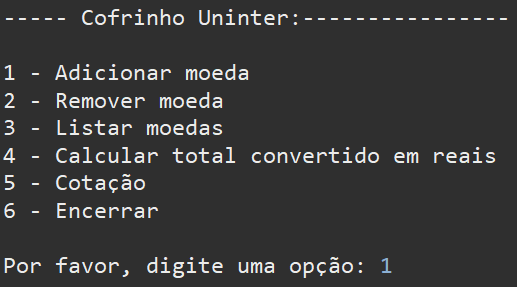

## Atividade Prática - COFRINHO
### Programação orientada a objetos | UNINTER

---

## Solicitação
Nessa atividade foi solicitado ao aluno construir um programa em Java (console), para aplicar os pilares do paradigma orientado a objetos. O objetivo principal do trabalho foi avaliar o bom uso do conceito de herança e polimorfismo. O projeto deveria possuir uma classe Principal além das classes descritas em um diagrama UML. A classe Cofrinho deveria possuir como atributo uma coleção de Moedas, que por sua vez é uma classe mãe abstrata de outras classes específicas de Dolar, Euro, Real, etc... A coleção de Moedas poderia implementada utilizando um ArrayList, ou qualquer outra estrutura de dados que o estudante julgasse pertinente.

---

### Realização
Durante a implementação escrevi a classe Moeda, e suas derivadas Euro, Dolar e Real, extendendo Moeda, todas no pacote moedas. Nos construtores, alimentei o construtor da superclasse. O programa principal, Cofrinho, que possui o ponto de entradas main(String[] args) ficou no pacote main, responsável por escrever na console a interface texto e coletar o input do usuário utilizando a classe Scanner. Esse programa construia as moedas e armazenava em uma ArrayList genérica de Moeda, favorecendo o polimorfismo.

- Menu principal:

  

---

### Conclusão
O trabalho se mostrou relativamente simples, porém didático e objetivo para a prática de conhecimentos inerentes ao paradigma OO, revisando conceitos básicos e exigindo de mim, (que estou mais habitual atualmente com C-sharp), relembrar a sintaxe java e exercitar os conhecimntos comuns entre as duas linguagens.
